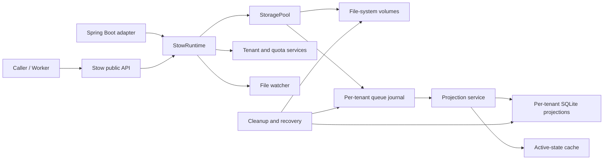

# Stow 1.0 Design Baseline

## 1. Document Status

- Project: Stow
- Design baseline: [cocosip/Locus](https://github.com/cocosip/Locus) 2.0.0,
  commit `292bd2c`
- Java baseline: OpenJDK 21
- Build tool: Maven 3.9+
- GitHub organization and repository: `cocosip/stow`
- Baseline date: 2026-09-18
- Target first release: `1.0.0` after all acceptance checks pass

This document is the complete Stow 1.0 design and acceptance baseline.
Features may be implemented in dependency order, but the project must not be
declared complete or release 1.0.0 until every required capability in the
Locus 2.0 alignment matrix is implemented and verified.

## 2. Goals And Boundaries

Stow is a high-concurrency, multi-tenant, multi-volume file queue. A caller
submits a file and receives a generated `fileKey`; workers claim files with a
lease and then complete or fail them. Stow owns placement, queue state,
retries, quotas, cleanup, recovery, directory import, and runtime statistics.

Stow is not a general file system that accepts arbitrary physical paths and is
not an object-storage client. Version 1 supports local or operating-system
mounted volumes; NFS, SMB, and Kubernetes PVC are used through their mounted
paths. S3 and other object stores are out of scope for 1.0, but SPI boundaries
must not prevent a future adapter.

One Stow process owns a set of metadata, quota, queue, and volume directories.
Multiple producers and consumers may run inside that process. Sharing the same
directories between processes is unsupported.

## 3. Project Identity And Coordinates

| Item | Value |
| --- | --- |
| Project | Stow |
| GitHub owner | `cocosip` |
| Maven group | `io.github.cocosip` |
| Java root package | `io.github.cocosip.stow` |
| Core artifact | `io.github.cocosip:stow-core` |
| Spring Boot artifact | `io.github.cocosip:stow-spring-boot-starter` |
| License | MIT |
| Development version | `0.1.0-SNAPSHOT` |
| First release | `1.0.0` |

Java packages are lowercase. Public APIs use `io.github.cocosip`, the
verifiable Maven Central namespace corresponding to the GitHub account.

## 4. Overall Architecture

Stow has three sources of truth:

1. Physical files on storage volumes are the source of file content.
2. The append-only per-tenant `queue.log` is the durable source of queue
   state transitions.
3. Per-tenant SQLite databases are queryable, rebuildable projections, not the
   sole source of file content or final queue facts.

Memory caches accelerate active-state, lease, and quota decisions. They can be
rebuilt from SQLite, journals, and physical files after process exit.



Dependency direction is public API and domain model -> core use cases -> SPI
-> default implementations. The Spring Boot starter depends on `stow-core`;
core never depends on Spring.

## 5. Maven Project Structure

Only two artifacts are released:

```text
stow/
  pom.xml                         # Aggregator and version management
  stow-core/                      # Framework-neutral implementation
    src/main/java/
    src/test/java/
  stow-spring-boot-starter/       # Spring Boot adapter and lifecycle
    src/main/java/
    src/test/java/
  samples/
    stow-sample-console/          # Runnable, not published
    stow-sample-spring-boot/      # Runnable, not published
  benchmarks/                     # JMH runner, not published
  docs/
```

File-system, SQLite, logging, and projection boundaries remain packages and
SPIs inside `stow-core`; a new artifact is justified only for a second real
production implementation with independent dependencies.

## 6. Java Package Structure

```text
io.github.cocosip.stow
  Stow, StowBuilder, StowRuntime
  api/        public services
  model/      tenant, file, lease, queue, cleanup, watcher, statistics models
  config/     immutable configuration records and validators
  exception/  public exception hierarchy
  spi/        volume, projection, journal, and codec extension contracts
  internal/   filesystem, journal, projection, sqlite, scheduler, quota,
              tenant, cleanup, recovery, watcher, statistics, runtime
```

`internal` is not a compatibility promise. Public types may reference only
the root, `api`, `model`, `config`, `exception`, and explicitly public `spi`
packages. Both release JARs declare stable `Automatic-Module-Name` values; 1.0
does not require `module-info.java` because of ecosystem module constraints.

## 7. Technology And Dependency Baseline

- Java 21 with Maven Compiler `--release 21`.
- SQLite JDBC (`org.xerial:sqlite-jdbc`) without an ORM or connection pool.
- Jackson 2.x for state files, snapshots, tenant/watcher configuration, and
  JsonLines journals.
- SLF4J API 2.0.17 only; the host selects a provider.
- JUnit Jupiter, AssertJ, Mockito, Awaitility, and JMH.
- Maven Enforcer, Surefire, Failsafe, JaCoCo, Spotless, and SpotBugs.

Third-party versions are locked in root `dependencyManagement`; dynamic
versions and ranges are forbidden. Dependencies are audited on introduction
and upgrade.

### 7.1 SLF4J Compatibility

`stow-core` includes no Logback, Log4j2, JUL bridge, or provider. The host
selects one SLF4J 2 provider. The compatibility profile verifies API 1.7.36
with a test-only binding. The validation matrix covers SLF4J 2 with a provider,
SLF4J 1.7 compatibility, API-only NOP behavior, and a dependency tree without
a concrete logging implementation from `stow-core`.

Logs use parameterized placeholders and avoid file contents, full physical
paths, and original names by default. Diagnostic levels control any file key,
tenant, or path values.

## 8. Dependency Injection And Lifecycle

`stow-core` does not depend on Spring, CDI, Guice, Jakarta Inject, or another
container. Constructor injection is used internally, with one explicit
composition root, `DefaultStowRuntimeFactory`.

```java
try (StowRuntime runtime = Stow.builder()
        .configuration(configuration)
        .build()) {
    runtime.start();
    StoragePool storagePool = runtime.storagePool();
}
```

`Stow.open(configuration)` builds and starts. `build()` creates no background
threads; `start()` performs database checks, volume mounting, projection
recovery, and service startup. `close()` is idempotent and stops watchers and
maintenance, rejects new leases and writes, drains projections and metadata,
flushes journal/state/cursor/snapshot and SQLite, then closes executors and JDBC
resources. States are `NEW -> STARTING -> RUNNING -> STOPPING -> TERMINATED`,
with failures entering `FAILED`. Business APIs fail fast outside `RUNNING`.

Core owns named thread factories, schedulers, and virtual-thread executors.
Advanced callers may inject `Clock`, executors, and public SPI implementations,
but no general Service Locator is exposed.

## 9. Public API Model

The public API is synchronous and blocking because filesystems and SQLite JDBC
are blocking resources; Java 21 virtual threads provide scalable concurrency.
All services are thread-safe and blocking calls honor interruption by restoring
the flag and throwing `StowInterruptedException`.

`StoragePool` writes an `InputStream` or `ContentSource`, reads by tenant and
file key, returns metadata/location, claims one or many files, completes or
fails a `ProcessingLease`, reports status, and reports total/available
capacity. Other services cover tenants, quotas, maintenance, projection,
watchers, and statistics as defined in the API contract.

## 10. File And Event State Machine

Required file states are `PENDING`, `PROCESSING`, `COMPLETED`, `FAILED`,
`PERMANENTLY_FAILED`, `DELETE_REQUESTED`, `DELETE_SUCCEEDED`, and
`DEAD_LETTERED`. Required durable events are `ACCEPTED`,
`PROCESSING_STARTED`, `PROCESSING_FAILED`, `PROCESSING_TIMED_OUT`,
`PROCESSING_COMPLETED`, `DELETE_REQUESTED`, `DELETE_SUCCEEDED`, and
`DEAD_LETTERED`.

The reducer is shared by projection, recovery, and tests. Unknown event
versions are never skipped; the original log is retained and the tenant enters
an unwritable maintenance-failure state.

## 11. Physical Storage Volumes

The default `LocalFileSystemVolume` has an ID, mount path, sharding depth,
buffer, force-flush flag, and health checks. Paths are generated as:

```text
{mountPath}/{tenantId}/{shard0}/{shard1}/{fileKey}{validatedExtension}
```

Sharding depth is 0..3, with two file-key hex characters per level. Callers
cannot supply physical paths. Writes use same-directory temporary files,
optional `FileChannel.force(true)`, and atomic moves; unsafe cross-file-system
fallbacks fail. Volumes enter the writable set only after health checks.
Power-of-two choices select a healthy volume with sufficient capacity. A
repeatable content source may retry another volume; a single-use source may
not be replayed.

## 12. Write, Read, Claim, And Completion Flows

Writes validate runtime, tenant, and options; generate a key; reserve quotas;
write the physical file atomically; append and acknowledge `ACCEPTED`; update
the active cache and SQLite queue; then return the key. Any failure preserves
the invariant that a physical file cannot remain while its quota is released.

Reads validate tenant ownership, use active cache/SQLite metadata, verify the
registered volume, and open the physical stream. Cross-tenant access appears as
not found; missing physical files raise `PhysicalFileMissingException`.

Claims use SQLite conditional updates and per-file striped locks. Candidates
are due `PENDING` or `FAILED` files. A successful claim creates a new lease,
appends `PROCESSING_STARTED`, and changes the status to `PROCESSING`. Batch
claims return independent leases and may contain fewer entries than requested.

Completion appends `PROCESSING_COMPLETED` and `DELETE_REQUESTED`; a background
reaper deletes the physical file, appends `DELETE_SUCCEEDED`, and then removes
the projection and quota. Failure records retry count, error, and backoff;
timeout emits `PROCESSING_TIMED_OUT` and returns the item to `PENDING` without
reusing the old lease.

## 13. Per-Tenant Journals

Each tenant has `queue.log`, `queue.state.json`, `projector.cursor.json`, and
`projection.snapshot.json`. The default binary format has magic, lengths,
sequence, payload, and CRC32; JsonLines is a diagnostic format. Existing logs
retain their format. Sequences are strictly monotonic, and only a deterministic
bad tail may be truncated. `DURABLE`, `BALANCED`, and `ASYNC` acknowledgements
have the meanings defined in the persistence contract. ASYNC uses bounded
queues, exposes backlog and rejection state, and drains on close.

Projection is fair across tenants and bounded by tenant count, record count,
and time budget. A batch applies idempotently in SQLite before advancing the
cursor. Compaction is allowed only after a current snapshot is durable and the
projector reaches the journal tail.

## 14. SQLite Projections And Caches

Each tenant has independent metadata and quota databases. Metadata stores file
state, leases, retries, times, volume, and path; quota stores logical-directory
limits and counts. SQLite defaults to WAL and supports configured synchronous,
busy-timeout, cache-size, and checkpoint settings.

The active cache excludes permanently removed history and loads in batches.
Metadata write-behind uses bounded queues, batch transactions, soft merge,
periodic flush, and shutdown drain. Queue saturation applies backpressure or
fails explicitly; it never drops data. `quick_check`/`integrity_check` detects
corruption. Rebuild uses snapshot plus journal for metadata and active metadata
rows for quota before falling back to physical scans.

## 15. Tenants And Quotas

Tenant metadata persists ID, enabled state, creation/update times, and quota.
IDs reject empty values, traversal, separators, controls, and platform device
names. Tenant and directory quotas count files; `0` is unlimited. Writes first
reserve a count, `ACCEPTED` consumes the reservation, and
`DELETE_SUCCEEDED`/`DEAD_LETTERED` release active count. All compensation is
idempotent; reconciliation is an explicit maintenance operation.

## 16. Cleanup, Recovery, And Maintenance

The implementation provides timeout lease reclamation, two-phase deletion,
KEEP/MOVE_TO_DEAD_LETTER/DELETE policies, dead-letter paths, orphan recovery,
missing-file diagnostics, junk and empty-directory cleanup, database-backup
cleanup, checkpoint/VACUUM, retired-volume policies, and quota reconciliation.

Startup order is configuration validation, directory/volume checks, database
health and rebuild, journal-tail repair, projection recovery, tenant
initialization, READY, then cleanup/recovery/watchers/statistics. A recurring
task failure affects that round and health; fact corruption or critical
recovery failure enters FAILED or read-only maintenance mode.

## 17. File Watchers

Watchers poll instead of relying solely on `WatchService`, so network mounts,
container volumes, and lost events remain discoverable. They support
registration, persistence, single- and multi-tenant discovery, recursive and
glob filters, size/age and stability checks, bounded import concurrency,
DELETE/MOVE/KEEP post-actions, durable import history, debounce, retention,
and counters.

Import order is stability check, `StoragePool.write`, durable history, then the
post-import action. A post-action failure never causes duplicate import; the
next scan retries the action using history.

## 18. Statistics, Health, And Logging

Statistics are disabled by default and otherwise aggregate fixed in-memory
time buckets with retention and a series limit. They cover writes, reads,
claims, completions, SQLite persistence, and watcher activity without using
file keys or paths as high-cardinality labels.

Health includes runtime, volume, journal, projection, SQLite, cleanup, and
watcher components with `UP`, `DEGRADED`, and `DOWN`. The starter bridges these
to Actuator and Micrometer only when those dependencies are present. Logging is
SLF4J 2 API only; provider selection belongs to the host.

## 19. Configuration Model

Configuration is immutable, created by a builder, and validated once. Groups
cover paths, tenants, volumes, SQLite, metadata repository, storage pool,
retry, journal/projection/snapshot/compaction, cleanup/recovery, watchers, and
statistics. Core does not read Spring YAML or environment naming conventions.
The starter binds `stow.*` into the same core model. Normalized paths must
remain inside configured roots.

## 20. Spring Boot Starter

The starter is an adapter, not a second business implementation. It supplies
`@AutoConfiguration`, `AutoConfiguration.imports`, `@ConfigurationProperties`
with prefix `stow`, one `StowRuntime`, public service beans, `SmartLifecycle`,
and conditional Actuator/Micrometer bridges. Public extension beans may be
provided with `@ConditionalOnMissingBean`; internal components cannot be
replaced. The starter adds no logging provider or bridge.

Applications inject `StoragePool`, `TenantManager`, or `StowRuntime` by
constructor. The starter owns startup and shutdown, so application code does
not call `start()` or `close()` on injected beans.

## 21. Exception Model

`StowException` is unchecked. Fixed subclasses include configuration, runtime,
tenant, quota, storage, lease, physical-file, journal, projection, database,
and interruption exceptions listed in the API contract. Messages exclude file
contents and sensitive metadata; recoverable background errors are represented
in logs, statistics, and health rather than swallowed.

## 22. Concurrency, Backpressure, And Limits

- Per-file striped locks serialize completion, failure, and reclaim races.
- Per-tenant journal writers preserve event order while tenants run in parallel.
- SQLite writes are serialized per tenant; reads use short connections and
  busy timeouts.
- Journal, metadata, and watcher queues are bounded and apply backpressure.
- Scans have tenant/record batches, time budgets, and cancellation.
- Virtual threads handle independent blocking work; schedulers use few named
  platform threads.
- Caches have a capacity or TTL; all streams, connections, channels, and
  iterators have deterministic close paths.

## 23. Security And Data Protection

Validate lengths and characters for every identifier, normalize and root-check
paths, do not follow links by default, keep original names out of path
construction, parameterize all SQL, avoid PHI/PII and high-cardinality labels,
and use host permissions for temporary files, databases, and journals.

## 24. Test And Verification Requirements

Tests cover reducer transitions, leases and races, quota reservation and
reconciliation, path and link safety, volume selection, binary/JSON codecs and
CRC, projection replay/snapshot/compaction/rebuild, SQLite batching and
recovery, cleanup/dead-letter/orphans, watchers, statistics, lifecycle, crash
boundaries, concurrent producers/consumers, and long-running resource bounds.
Use real temporary directories and SQLite for durability behavior. Samples are
runnable programs and intentionally do not contain unit tests.

CI runs `mvnw verify`, the SLF4J 1.7 compatibility profile, the Spring Boot
compatibility profile, and the benchmark package on Windows and Linux with
JDK 21. Release checks also cover dependency, license, API compatibility, and
reproducible-build evidence.

## 25. Locus 2.0 Alignment Matrix

| Capability | Stow component | 1.0 acceptance |
| --- | --- | --- |
| Tenant lifecycle and isolation | tenant | Required |
| Tenant and directory quotas | quota | Required |
| Volumes, health, capacity, sharding | filesystem/storage | Required |
| Write, read, info, location | `StoragePool` | Required |
| Claims and leases | scheduler | Required |
| Retry, backoff, permanent failure | scheduler | Required |
| Queue events and journal formats | journal/model | Required |
| CRC, sequences, tail repair | journal | Required |
| SQLite projections and active cache | projection/sqlite | Required |
| Cursor, snapshot, compaction, rebuild | projection | Required |
| Two-phase deletion and dead-letter | cleanup | Required |
| Timeout reclaim and orphan recovery | recovery | Required |
| Database health, rebuild, optimization | sqlite/recovery | Required |
| Quota reconciliation and cleanup | maintenance | Required |
| Watcher configuration and automation | watcher | Required |
| Runtime statistics and diagnostics | statistics | Required |
| Host lifecycle integration | core runtime + starter | Required |

## 26. Definition Of Done

Stow 1.0 is complete only when the alignment matrix is implemented, core runs
without Spring, the starter integrates the same runtime, Windows and Linux
tests pass, SLF4J 1.7/2.x compatibility is verified, persistence recovery has
automated evidence, documentation matches the implementation, and Central
Portal metadata, sources, Javadoc, signatures, license, and reproducible-build
checks pass.

## 27. Explicit Non-Commitments

Stow does not promise Locus .NET journal, SQLite, or configuration
interoperability; support multiple writers to one directory set; include object
storage, distributed databases, or a remote control plane in 1.0; bind Spring,
Micrometer, Actuator, or a logging implementation in core; or expose internal
repositories, pools, and reducers as stable APIs.
