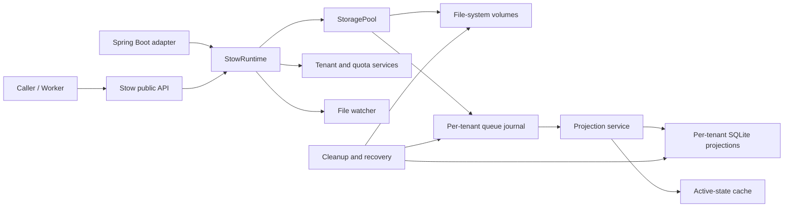

# Stow 文件存储池设计

## 1. 文档状态

- 项目：Stow
- 设计基线：[cocosip/Locus](https://github.com/cocosip/Locus) 2.0.0（提交 `292bd2c`）
- Java 基线：OpenJDK 21
- 构建工具：Maven 3.9+
- GitHub 组织：`cocosip`
- 目标仓库：`https://github.com/cocosip/stow`
- 文档日期：2026-09-18
- 目标版本：全部验收通过后发布 `1.0.0`

本文档是 Stow 1.0 的完整设计与验收基线。实现可以按依赖顺序开展，但不按功能拆分发布；在本文列出的 Locus 2.0 对齐能力全部完成前，不得把项目声明为功能完成，也不得发布 1.0.0。

## 2. 目标与边界

Stow 是一个高并发、多租户、多存储卷的文件队列系统。调用方提交文件后得到系统生成的 `fileKey`，工作线程通过租约领取文件，随后完成或报告失败。系统负责文件放置、队列状态、重试、配额、清理、恢复、目录导入和运行统计。

Stow 不是允许调用方自由指定物理路径的通用文件系统，也不是对象存储客户端。首个正式版本提供本地或已挂载文件系统上的存储卷；NFS、SMB、Kubernetes PVC 等通过操作系统挂载后按本地路径使用。S3 等对象存储不在 1.0 范围内，但 SPI 边界不得阻止后续扩展。

同一套 metadata、quota、queue 和 volume 目录只允许一个 Stow 运行实例拥有写权限。进程内允许多个生产者和消费者并发访问；跨进程共享同一套运行目录不属于支持范围。

## 3. 项目标识与发布坐标

| 项目 | 值 |
| --- | --- |
| 项目名 | Stow |
| GitHub owner / organization | `cocosip` |
| Maven groupId | `io.github.cocosip` |
| Java 根包名 | `io.github.cocosip.stow` |
| 核心制品 | `io.github.cocosip:stow-core` |
| Spring Boot 制品 | `io.github.cocosip:stow-spring-boot-starter` |
| License | MIT |
| 开发版本 | `0.1.0-SNAPSHOT` |
| 首个正式版本 | `1.0.0` |

Java 包名全部使用小写。公开 API 不使用 `com.cocosip`，因为 Maven Central 上与 GitHub 账户对应、可验证的规范命名是 `io.github.cocosip`。

## 4. 总体架构

Stow 保留 Locus 2.0 的三层真实来源：

1. 存储卷上的物理文件是文件内容的真实来源。
2. 每租户追加写的 `queue.log` 是队列状态迁移的耐久真实来源。
3. 每租户 SQLite 数据库是可查询、可重建的投影，不是文件内容或最终队列事实的唯一来源。

内存缓存仅用于加速活跃状态查询、租约和配额判断，进程退出后可以从 SQLite、日志和物理文件恢复。



依赖方向固定为：公开 API 和领域模型 -> 核心用例 -> SPI -> 默认实现。Spring Boot Starter 只依赖 `stow-core`，核心不得反向依赖 Spring。

## 5. Maven 工程结构

仓库只发布两个正式制品：

```text
stow/
  pom.xml                         # 聚合、插件和依赖版本管理，不发布
  stow-core/                      # 完整的框架无关实现
    src/main/java/
    src/test/java/
  stow-spring-boot-starter/       # Spring Boot 自动配置与生命周期适配
    src/main/java/
    src/test/java/
  samples/
    stow-sample-console/          # 不发布
    stow-sample-spring-boot/      # 不发布
  benchmarks/                     # JMH，不发布
  docs/
    stow-design.md
```

不为文件系统、SQLite、日志、投影等内部边界分别发布 JAR。它们在 `stow-core` 内通过包和 SPI 隔离；只有出现第二种真实生产实现并需要独立依赖时，才增加新的适配器制品。

## 6. Java 包结构

```text
io.github.cocosip.stow
  Stow
  StowBuilder
  StowRuntime
  api/
    StoragePool
    TenantManager
    TenantQuotaManager
    DirectoryQuotaManager
    StorageMaintenance
    QueueProjectionMaintenance
    FileWatcherManager
    FileWatcherOptionsManager
    FileWatcherAutoManager
    StatisticsReader
  model/
    tenant, file, lease, queue, cleanup, watcher, statistics models
  config/
    immutable core configuration records and validators
  exception/
    public exception hierarchy
  spi/
    StorageVolume, MetadataProjectionStore, QueueEventJournal,
    JournalCodec and extension contracts
  internal/
    filesystem/
    journal/
    projection/
    sqlite/
    scheduler/
    quota/
    tenant/
    cleanup/
    recovery/
    watcher/
    statistics/
    runtime/
```

`internal` 包不是公共兼容承诺。公共 API 只能引用根包、`api`、`model`、`config`、`exception` 和明确公开的 `spi` 类型。

两个发布 JAR 都声明稳定的 `Automatic-Module-Name`，但 1.0 不强制使用 `module-info.java`，以避免 SQLite JDBC、Jackson 和框架生态的模块兼容性限制。

## 7. 技术基线与依赖策略

### 7.1 核心技术

- Java：OpenJDK 21，Maven Compiler 使用 `--release 21`。
- SQLite：`org.xerial:sqlite-jdbc`，使用 JDBC 直接访问；不引入 ORM 或连接池。
- JSON：Jackson 2.x，用于状态文件、快照、租户和 watcher 配置以及 JsonLines 日志格式。
- 日志：`org.slf4j:slf4j-api:2.0.17`。
- 测试：JUnit Jupiter、AssertJ、Mockito、Awaitility。
- 基准测试：JMH。
- 构建质量：Maven Enforcer、Surefire、Failsafe、JaCoCo、Spotless 和 SpotBugs。

除 SLF4J 外，第三方库在根 `dependencyManagement` 中锁定精确版本，并在首次实现及每次升级时执行依赖漏洞审计。业务代码不得依赖 Maven 动态版本或版本范围。

### 7.2 SLF4J 兼容策略

`stow-core` 的日志门面只依赖 `slf4j-api:2.0.17`，不携带 Logback、Log4j2、JUL bridge 或任何绑定/Provider。宿主在应用边界选择一个与 2.x API 匹配的 provider；传统 1.7 宿主可通过兼容 profile 验证。

验证矩阵必须覆盖：

- `slf4j-api 2.0.17` + 2.x Provider；
- `slf4j-api 1.7.36` + 1.7 兼容测试绑定；
- 无 Provider 时只出现 SLF4J 自身提示，Stow 功能仍可运行；
- 依赖树中不得由 `stow-core` 引入具体日志实现。

所有日志使用参数化占位符；默认不记录文件内容、完整物理路径或原始文件名。`fileKey`、租户和路径只在必要的 DEBUG/诊断事件中出现，并允许宿主通过日志级别控制。

## 8. 依赖注入与生命周期

`stow-core` 不依赖 Spring、CDI、Guice、Jakarta Inject 或其他 DI 容器。内部仍使用构造器注入，由唯一组合根 `DefaultStowRuntimeFactory` 显式创建对象图。

```java
try (StowRuntime runtime = Stow.builder()
        .configuration(configuration)
        .build()) {
    runtime.start();
    StoragePool storagePool = runtime.storagePool();
}
```

`Stow.open(configuration)` 是构建并启动的便捷入口。`build()` 不创建后台线程，`start()` 才执行数据库检查、卷挂载、投影恢复并启动后台服务。`close()` 必须幂等，并按下列顺序关闭：

1. 停止接受 watcher 扫描和后台维护任务；
2. 停止新租约和新写入；
3. 排空投影与 metadata write-behind 队列；
4. 刷新 journal、state、cursor、snapshot 和 SQLite WAL；
5. 关闭执行器和 JDBC 资源。

启动状态为 `NEW -> STARTING -> RUNNING -> STOPPING -> TERMINATED`，失败进入 `FAILED`。非 `RUNNING` 状态调用业务 API 必须快速失败。重复 `start()` 或 `close()` 有确定、可测试的幂等语义。

核心拥有自己的命名线程工厂、调度器和虚拟线程执行器；高级调用方可以通过受限 SPI 注入 `Clock`、执行器和存储卷实现。不得暴露一个允许替换所有内部对象的通用 Service Locator。

## 9. 公共 API 设计

公共 API 采用同步阻塞模型。文件系统与 SQLite JDBC 本质上是阻塞资源，JDK 21 虚拟线程可以直接扩展并发；不在核心 API 中强制 `CompletableFuture`，避免把执行器所有权、取消和异常包装转嫁给调用方。

所有公共服务线程安全。阻塞操作必须响应线程中断；实现捕获 `InterruptedException` 时恢复中断标志并抛出 `StowInterruptedException`。

### 9.1 StoragePool

核心能力包括：

- 写入 `InputStream`，系统生成 file key；
- 可选原始文件名，仅保留经过验证的扩展名；
- 可选逻辑目录，用于目录配额，不映射为任意物理路径；
- 按租户和 file key 读取文件；
- 查询基本信息和诊断位置；
- 单个或批量领取待处理文件；
- 使用租约标记成功或失败；
- 查询状态、总容量和可用容量。

推荐的 Java 形态：

```java
public interface StoragePool {
    String write(TenantContext tenant, InputStream content, WriteOptions options);
    InputStream read(TenantContext tenant, String fileKey);
    Optional<StoredFileInfo> findFileInfo(TenantContext tenant, String fileKey);
    Optional<FileLocation> findFileLocation(TenantContext tenant, String fileKey);
    Optional<ClaimedFile> claimNext(TenantContext tenant);
    List<ClaimedFile> claimBatch(TenantContext tenant, int batchSize);
    void complete(ProcessingLease lease);
    void fail(ProcessingLease lease, String errorMessage);
    FileProcessingStatus status(TenantContext tenant, String fileKey);
    long totalCapacity();
    long availableCapacity();
}
```

`read` 返回的流由调用方关闭。`ClaimedFile` 始终同时携带位置和非空租约，避免 Locus 中“位置对象的 lease 可能为空”的表达。所有时间使用 UTC `Instant`，时间段使用 `Duration`。

### 9.2 租约

`ProcessingLease` 包含 `tenantId`、`fileKey`、随机 `leaseId` 和 `startedAt`。`leaseId` 是并发校验的权威值，`startedAt` 用于超时和诊断。这比仅用时间戳识别租约更稳健，同时保留 Locus 2.0 的租户作用域和过期租约保护语义。

完成/失败操作必须满足：

- 同一租约的重复完成或重复失败是幂等的；
- 与已释放租约一致的迟到完成按已定义恢复规则处理；
- 不同 `leaseId`、其他租户或普通 Pending 文件必须抛出 `LeaseMismatchException`；
- 失败与完成并发时按每 file key 的条带锁串行化，最终只允许一种合法迁移；
- 租约校验失败不得减少配额、删除物理文件或追加错误事件。

### 9.3 其他公共服务

- `TenantManager`：创建、查询、列举、启用和禁用租户，支持显式配置的自动创建策略。
- `TenantQuotaManager`：设置/查询租户文件数上限和当前计数。
- `DirectoryQuotaManager`：对规范化逻辑目录设置/查询上限与计数。
- `StorageMaintenance`：清理、孤儿恢复、配额对账、数据库健康/重建/优化。
- `QueueProjectionMaintenance`：状态查询、replay、snapshot、rebuild。
- `FileWatcherManager`：注册、更新、删除、启停、查询和立即扫描。
- `FileWatcherOptionsManager`：管理持久化的全局 watcher 设置。
- `FileWatcherAutoManager`：按根目录配置发现租户并管理 watcher。
- `StatisticsReader`：查询内存时间窗口统计快照。

## 10. 文件与事件状态机

### 10.1 文件状态

必须实现下列状态：

| 状态 | 含义 |
| --- | --- |
| `PENDING` | 可领取 |
| `PROCESSING` | 已被有效租约领取 |
| `COMPLETED` | 处理成功，等待删除请求投影 |
| `FAILED` | 处理失败但仍可重试 |
| `PERMANENTLY_FAILED` | 达到最大重试次数 |
| `DELETE_REQUESTED` | 已请求后台物理删除 |
| `DELETE_SUCCEEDED` | 物理删除完成，等待最终投影清理 |
| `DEAD_LETTERED` | 已移动到 dead-letter 并移出活跃配额 |

### 10.2 耐久事件

每租户日志必须支持：`ACCEPTED`、`PROCESSING_STARTED`、`PROCESSING_FAILED`、`PROCESSING_TIMED_OUT`、`PROCESSING_COMPLETED`、`DELETE_REQUESTED`、`DELETE_SUCCEEDED` 和 `DEAD_LETTERED`。

事件记录包含 schema version、event ID、租户、file key、事件类型、UTC 时间、单租户单调序号、CRC、卷、物理路径、逻辑目录、大小、状态、租约、重试、下次可领取时间、错误摘要、原始文件名和扩展名。错误摘要和原始文件名必须有长度上限。

状态迁移由统一 reducer 定义，投影、恢复和单元测试共用同一规则。未知事件版本不得被静默跳过；系统保留原日志并进入不可写的维护失败状态。

## 11. 物理存储卷

默认实现 `LocalFileSystemVolume`，每个卷包含唯一 ID、挂载路径、分片深度、缓冲区、强制刷盘选项和健康检查参数。

物理路径由系统生成：

```text
{mountPath}/{tenantId}/{shard0}/{shard1}/{fileKey}{validatedExtension}
```

分片深度支持 0 到 3，每级使用 file key 的两个十六进制字符。租户、file key、扩展名和逻辑目录都必须经过独立校验，调用方不得传入物理路径。

写入采用同目录临时文件、可选 `FileChannel.force(true)` 和原子移动。目标文件在完整写入前不可见。原子移动不可用时，只有经过显式检测且保证同文件系统的安全替代路径才允许继续；否则写入失败并清理临时文件。

卷挂载必须连续通过健康检查后才进入可写集合。容量与健康结果短时缓存。多卷选择使用 power-of-two choices，在健康且容量足够的候选中选择可用空间更大的卷，避免固定命中单卷。可重复读取的输入流写失败后可以重置并尝试下一卷；不可重复流不得自动重放。

## 12. 写入、读取与领取流程

### 12.1 写入

写入顺序固定为：

1. 校验运行时、租户状态和参数；
2. 生成 file key 并规范化逻辑目录；
3. 在同一 quota 事务中原子预留租户与目录配额；
4. 选择卷和物理路径；
5. 完成物理文件原子写入；
6. 追加 `ACCEPTED` 事件并按 ACK 模式确认；
7. 更新内存投影并排队写入 SQLite；
8. 返回 file key。

物理写入前失败必须回滚配额。物理文件已成功但 journal 追加失败时，先尝试删除文件并回滚配额；删除也失败时保留配额并把文件留给孤儿恢复。任何路径都不得出现“物理文件仍存在但配额已释放”的无保护状态。

### 12.2 读取

读取先校验租户，再从活跃缓存/SQLite 投影获取元数据，确认元数据属于当前租户和已注册卷，然后打开物理文件流。跨租户访问表现为未找到，不泄露文件是否存在。元数据存在但文件丢失时抛出明确的 `PhysicalFileMissingException` 并记录维护指标。

### 12.3 领取与批量领取

领取使用 SQLite 条件更新和进程内条带锁保证同一文件不会同时发给两个线程。合法候选是到达 `availableAt` 的 `PENDING` 或 `FAILED` 文件。领取成功后生成新租约、迁移到 `PROCESSING` 并追加 `PROCESSING_STARTED`。日志追加失败时必须把投影恢复到领取前状态。

批量领取对每个文件提供独立租约；结果可少于请求数量。一个文件失败不得使已经成功领取且已耐久记录的其他文件回滚为重复可领取。

### 12.4 完成、失败和超时

完成依次追加 `PROCESSING_COMPLETED` 与 `DELETE_REQUESTED`，物理删除由低速后台 reaper 执行。删除成功后追加 `DELETE_SUCCEEDED`，随后移除 SQLite/内存投影并扣减租户及目录配额。

失败增加 retry count，记录错误摘要并按初始延迟、指数退避和最大延迟计算 `availableAt`。达到最大次数后进入 `PERMANENTLY_FAILED`。超时恢复追加 `PROCESSING_TIMED_OUT` 并重新变为 `PENDING`，不得沿用旧租约。

## 13. 每租户队列日志

每个租户目录至少包含：

```text
queue.log
queue.state.json
projector.cursor.json
projection.snapshot.json
```

### 13.1 格式与完整性

- 默认格式为 `BINARY_V1`：magic/version、长度、序号、payload 和 CRC32。
- 兼容诊断格式为 `JSON_LINES`。
- 非空日志自动识别已有格式，配置变更不能重解释历史文件。
- 每租户 sequence 严格单调；gap、重复和倒退都产生维护状态与指标。
- 启动和读取时扫描坏尾；只能截断最后一个不完整/CRC 错误记录，不能跨过中间损坏继续写。
- state、cursor 和 snapshot 通过临时文件、刷盘和原子替换更新。

### 13.2 确认模式

| 模式 | 返回成功的含义 |
| --- | --- |
| `DURABLE` | 当前微批次已写入并强制刷盘 |
| `BALANCED` | 已写入，刷盘在受限时间窗口内完成 |
| `ASYNC` | 已进入有界内存队列，尚未保证写入磁盘 |

`ASYNC` 必须使用有界队列并暴露 backlog、拒绝和最后刷盘状态，关闭时必须在配置的期限内排空。配置或运行时不得把 `ASYNC` 描述为耐久确认。

每租户 writer 支持 linger、最大记录数、最大字节数和空闲关闭。慢租户不得阻塞其他租户；同一租户保持写入顺序。

### 13.3 投影、快照和压缩

投影器按租户公平轮询，受每轮租户数、记录数和时间预算限制。一个批次先在 SQLite 事务中幂等应用，再原子推进 cursor。event ID 和 sequence 共同用于重复检测。

只有 projector 已追上 journal tail 且新 snapshot 成功落盘后才允许压缩。压缩删除已投影前缀并推进 base offset；崩溃后通过 snapshot + 剩余日志重建。快照、cursor 和日志 base/tail 不一致时必须拒绝破坏性压缩。

维护 API 支持状态查询、replay、snapshot 和完整 rebuild。rebuild 清空当前投影、恢复最近有效快照、重放日志尾部并对账配额。

## 14. SQLite 投影与内存缓存

每租户使用独立数据库：

```text
{metadataDirectory}/{tenantId}/metadata.db
{quotaDirectory}/{tenantId}/quotas.db
```

`metadata.db` 保存文件、状态、租约、重试、时间、卷和路径；`quotas.db` 保存逻辑目录计数与限制。数据库默认使用 WAL、可配置 synchronous、busy timeout、cache size 和 checkpoint 策略。

热缓存只保留 `PENDING`、`PROCESSING`、`FAILED`、`PERMANENTLY_FAILED`、删除中等活跃记录，不缓存已最终清除的历史。首次访问租户或进程重启时分批加载。

metadata write-behind 使用有界队列、批量事务、软合并阈值、周期刷写和关闭排空。队列满时不得静默丢弃：写路径要么施加背压，要么明确失败；queue journal 保持最终恢复依据。

数据库健康检查使用 `PRAGMA quick_check`/`integrity_check`。损坏文件改名为带时间戳的备份后，优先从 snapshot + journal 重建 metadata，再用投影重建 quota；只有缺少日志事实时才扫描物理卷。是否启动失败由 fail-fast 配置决定。

## 15. 多租户与配额

租户元数据持久化保存 tenant ID、启用状态、创建/更新时间和可选配额。tenant ID 必须限制长度，拒绝空值、`.`、`..`、路径分隔符、控制字符和平台保留名称。

租户配额与目录配额都按文件数计算，0 表示无限制。配置中的默认租户配额只用于创建租户；修改默认值不能静默改写已有租户。

配额模型区分 reservation 和 projected count：写入先预留，`ACCEPTED` 投影消费预留，`DELETE_SUCCEEDED` 或 `DEAD_LETTERED` 才减少活跃计数。所有补偿操作幂等。正常运行不周期性全量重算；对账是显式维护和恢复操作。

## 16. 清理、恢复和维护

完整实现下列后台与手工操作：

- 超时 `PROCESSING` 租约回收；
- `COMPLETED -> DELETE_REQUESTED -> DELETE_SUCCEEDED` 两阶段删除；
- 永久失败文件的 `KEEP`、`MOVE_TO_DEAD_LETTER`、`DELETE` 策略；
- dead-letter 的租户、日期和分片路径；
- 物理文件存在但投影缺失的孤儿恢复，重新生成 `ACCEPTED` 并进入 `PENDING`；
- 元数据存在但物理文件缺失的诊断和受控清理；
- 空目录和常见垃圾文件清理；
- SQLite 损坏备份清理；
- SQLite checkpoint、VACUUM/优化及租户批次间暂停；
- 已退役卷的 `KEEP` 或 `PURGE_METADATA_ONLY`；
- 单租户与全局配额对账；
- 每轮 tenant batch、最大孤儿数和查找缓存上限。

启动顺序必须是：配置校验 -> 目录和卷检查 -> 数据库健康/必要重建 -> journal 坏尾修复 -> projection 恢复 -> 租户初始化 -> 对外 READY -> 后台清理、恢复、watcher 和统计。恢复未完成前不得领取或写入。

后台任务单次异常只影响本轮并记录错误；连续失败达到阈值后进入 degraded health。涉及事实损坏、日志不可解析或关键恢复失败时进入 FAILED/只读维护状态，而不是继续接受写入。

## 17. 文件 Watcher

Watcher 使用轮询而不是只依赖 `WatchService`，确保在网络挂载、容器卷和事件丢失情况下仍能发现文件。功能包括：

- watcher 的注册、更新、删除、启用、禁用、查询和立即扫描；
- 配置和全局选项持久化，重启恢复；
- 单租户模式与“一级子目录即 tenant ID”的多租户模式；
- 根配置自动生成 watcher、发现新租户目录、可选创建租户目录；
- 递归开关、glob 模式、最大文件大小和最小文件年龄；
- 文件可访问性、大小/时间稳定性二次检查及老文件快速路径；
- watcher 内并发导入上限与全局并行扫描上限；
- 导入成功后的 `DELETE`、`MOVE`、`KEEP`；
- 已导入历史持久化、debounce 和过期裁剪；
- discovered/imported/skipped/failed/bytes 统计。

导入顺序为：稳定性检查 -> 调用 `StoragePool.write` -> 获得 file key -> 耐久保存导入历史 -> 执行原文件后置动作。Stow 写入成功但后置动作失败时不得重复导入；下一轮根据历史识别并重试后置动作。

## 18. 统计、指标、健康和日志

### 18.1 业务统计

统计默认关闭；关闭时使用 no-op recorder。启用后按固定时间桶在内存聚合，支持 retention、max series 和 tenant/volume/watcher/operation 维度开关。默认不启用高基数 tenant 维度，不记录 file key、文件名或物理路径作为维度。

至少提供写文件数/字节/吞吐、读取数、领取数、完成数、SQLite 持久化操作数以及 watcher 扫描与导入统计。统计不是耐久历史库。

### 18.2 低层诊断

核心公开只读诊断快照：journal append/flush 延迟、backlog、sequence gap、corrupt tail/repair、projection cursor lag、SQLite batch、卷健康与写入阶段耗时。Spring Boot Starter 在 Micrometer 存在时把这些数据桥接为 Meter，不要求 `stow-core` 依赖 Micrometer。

### 18.3 健康状态

运行时健康至少包含 runtime、volume、journal、projection、SQLite、cleanup 和 watcher 子状态，聚合为 `UP`、`DEGRADED`、`DOWN`。Starter 在 Actuator 存在时提供 HealthContributor。

## 19. 配置模型

核心配置是不可变 record，通过 builder 创建并在 `build()` 时一次性验证。配置分组：

- paths：metadata、quota、queue、watcher config；
- tenants：自动创建、默认配额、预配置租户；
- volumes：卷 ID、路径、分片、缓冲、刷盘和健康检查；
- sqlite：WAL、synchronous、cache、busy timeout、checkpoint；
- metadata repository：有界队列、批量、合并、加载、刷写和关闭期限；
- storage pool：条带锁、超时租约回收批次与 cooldown；
- retry：次数、初始延迟、指数退避和最大延迟；
- journal：目录、格式、ACK、micro-batch、投影、snapshot 和 compaction；
- cleanup/recovery：周期、保留、策略、批次、dead-letter 和退役卷；
- watcher：全局设置和 watcher 列表；
- statistics：时间桶、保留、series、维度和输出。

核心不读取 Spring YAML，也不依赖环境变量命名规则。普通 Java 应用通过 Java builder 或自行解析后创建配置。Starter 使用前缀 `stow.*` 绑定 `StowProperties`，转换为同一个核心配置模型。

路径规范化后必须确认在配置根目录或卷根目录内。相对路径按宿主工作目录解析并在启动日志中输出规范化根路径，但不逐文件输出路径。

## 20. Spring Boot Starter

Starter 只负责适配，不包含第二套业务实现：

- `@AutoConfiguration` 和 `AutoConfiguration.imports`；
- `@ConfigurationProperties(prefix = "stow")`；
- 创建一个 `StowRuntime`，并暴露公共服务 Bean；
- 使用 `SmartLifecycle` 启停 runtime；
- 在 Actuator/Micrometer 存在时条件注册健康和指标桥接；
- 支持用户提供 `Clock`、执行器或公开 SPI Bean 覆盖默认值；
- `@ConditionalOnMissingBean` 只用于公开扩展点，不允许任意替换内部实现；
- 不引入具体 SLF4J Provider 或日志桥接。

兼容测试覆盖 Spring Boot 3.5 支持线和当前 Spring Boot 4.x 支持线；宿主 BOM 可以把 core 的 SLF4J API 统一到 2.x。

## 21. 异常模型

`StowException` 是非受检根异常，至少包括：

- `InvalidConfigurationException`
- `RuntimeNotReadyException`
- `TenantNotFoundException`
- `TenantDisabledException`
- `TenantQuotaExceededException`
- `DirectoryQuotaExceededException`
- `NoFilesAvailableException`（批量/Optional API正常空结果不抛）
- `InsufficientStorageException`
- `StorageVolumeUnavailableException`
- `FileAlreadyProcessingException`
- `LeaseMismatchException`
- `PhysicalFileMissingException`
- `JournalCorruptionException`
- `ProjectionException`
- `DatabaseRecoveryException`
- `StowInterruptedException`

异常消息不得包含文件内容和敏感元数据。可恢复的后台错误进入结构化日志、统计和健康状态；公共 API 不得吞掉失败或只返回布尔值。

## 22. 并发、背压与资源上限

- per-file 条带锁保护完成/失败/回收竞态；条带数可配置且启动后不变。
- per-tenant journal writer 串行化事件顺序，不同租户并行。
- SQLite 每租户写操作串行批处理，读取使用短连接和 busy timeout。
- journal、metadata write-behind、watcher import 队列全部有界。
- 队列接近上限时先记录水位并施加背压；超过期限后明确失败。
- 后台扫描均支持 tenant batch、记录 batch、时间预算和取消。
- 使用虚拟线程处理独立阻塞任务；调度器本身使用少量命名平台线程。
- 不缓存无限 tenant、目录、file key 或历史错误；所有缓存有容量或 TTL。
- 每个公开流、JDBC 连接、文件通道和目录遍历器必须有确定关闭路径。

## 23. 安全与数据保护

- 所有 tenant ID、watcher ID、file key、扩展名和逻辑目录均做长度与字符校验。
- 使用 `Path.normalize()` 后验证 `startsWith(root)`，阻止路径穿越和符号链接逃逸。
- watcher 对符号链接默认不跟随；若未来开启必须有显式配置和环检测。
- 原始文件名只保存为受限元数据，不能参与目录构造。
- SQLite SQL 全部使用参数，不拼接用户值。
- 日志、指标标签和异常避免 PHI/PII 与高基数字段。
- 临时文件、数据库和 journal 使用宿主权限模型；Stow 不自行放宽 ACL。

## 24. 测试与验证要求

### 24.1 单元与组件测试

- 状态 reducer 的全部合法/非法迁移；
- lease 幂等、过期、跨租户和完成/失败竞态；
- tenant/directory quota 预留、消费、补偿和对账；
- 路径、扩展名、tenant ID 和符号链接安全；
- volume 健康、容量缓存、分片和多卷选择；
- binary/json codec、CRC、sequence、截断尾和中间损坏；
- projection 重放、重复事件、cursor、snapshot、compaction 和 rebuild；
- SQLite WAL、busy、批量、write-behind、关闭排空和数据库重建；
- completed 删除、永久失败策略、dead-letter、退役卷和孤儿恢复；
- watcher 稳定性、历史、并发、多租户发现和后置动作；
- statistics 时间桶、retention、维度和 series 上限；
- runtime 启停、失败启动、重复关闭和资源释放。

测试使用真实临时目录和真实 SQLite JDBC 验证耐久行为；mock 只用于故障注入和纯边界测试。文件系统语义测试在 Windows 与 Linux CI 都运行。

### 24.2 崩溃与恢复测试

必须在写入流程的每个持久化边界注入进程终止或 I/O 异常，并重启验证：

- 临时文件写到一半；
- 物理文件完成但 `ACCEPTED` 未完成；
- journal 完成但 SQLite 未投影；
- SQLite 事务完成但 cursor 未推进；
- snapshot 写入或替换中断；
- compaction 中断；
- `DELETE_REQUESTED` 后、物理删除前；
- 物理删除后、`DELETE_SUCCEEDED` 前；
- dead-letter 移动中断；
- metadata 或 quota 数据库损坏。

每个场景都要证明不会重复领取、不会静默丢文件、不会错误释放配额，并能通过日志/物理扫描恢复到确定状态。

### 24.3 并发与性能验证

- 多生产者、多消费者、批量领取和重复完成的压力测试；
- `jcstress` 或等价并发测试覆盖核心原子状态；
- JMH 覆盖 write path、journal append/flush、projection、metadata 冷启动、quota 和 watcher 扫描；
- 长时间运行验证线程、句柄、内存、SQLite WAL 和 queue.log 均不无界增长；
- 性能结果只用于回归基线，不替代正确性与崩溃恢复测试。

### 24.4 构建门禁

```text
mvnw verify
mvnw -Pslf4j1-compat verify
mvnw -Pspring-boot-compat verify
mvnw -Pbenchmarks package
```

CI 覆盖 Windows 与 Linux、JDK 21、SLF4J 1.7/2.x，以及 Spring Boot 最低/当前支持线。发布前执行依赖漏洞、许可证、API 二进制兼容和可复现构建检查。

## 25. Locus 2.0 功能对齐矩阵

| Locus 2.0 能力 | Stow 组件 | 1.0 验收 |
| --- | --- | --- |
| 多租户创建、启停、隔离 | tenant | 必须 |
| 租户与目录文件数配额 | quota | 必须 |
| 多卷、健康、容量、分片 | filesystem/storage | 必须 |
| 写、读、信息和位置查询 | StoragePool | 必须 |
| 单个/批量领取与租约 | scheduler | 必须 |
| 重试、退避和永久失败 | scheduler | 必须 |
| 八类队列事件 | journal/model | 必须 |
| BinaryV1、JsonLines、三种 ACK | journal | 必须 |
| CRC、sequence、坏尾修复 | journal | 必须 |
| SQLite 投影和活跃缓存 | projection/sqlite | 必须 |
| cursor、snapshot、compaction、rebuild | projection | 必须 |
| 两阶段删除 | cleanup/journal | 必须 |
| dead-letter 与三种失败策略 | cleanup | 必须 |
| processing timeout 回收 | recovery | 必须 |
| 物理孤儿恢复 | recovery | 必须 |
| 数据库健康、重建和优化 | sqlite/recovery | 必须 |
| 配额对账、垃圾文件、空目录 | maintenance | 必须 |
| 退役卷策略 | maintenance | 必须 |
| watcher 配置、扫描和自动管理 | watcher | 必须 |
| 进程内时间窗口统计 | statistics | 必须 |
| journal/projection/volume 诊断 | diagnostics | 必须 |
| 宿主生命周期集成 | core runtime + starter | 必须 |

## 26. 完成定义

Stow 1.0 只有同时满足以下条件才算完成：

1. 本文功能对齐矩阵全部实现，没有“后续版本补充”的必选能力。
2. `stow-core` 可在不使用 Spring 的 Java 21 控制台程序中完整运行。
3. `stow-spring-boot-starter` 使用同一核心 runtime 完成自动配置、生命周期、健康和可选指标集成。
4. Windows 与 Linux 的完整测试、崩溃恢复测试和并发测试通过。
5. SLF4J 1.7 与 2.x 兼容矩阵通过，核心依赖树不含日志实现。
6. journal、SQLite 和物理文件之间的恢复规则有自动化证据。
7. 示例、配置参考、运维恢复手册和公开 API 文档与实现一致。
8. Maven Central 发布元数据、源码包、Javadoc、签名、许可证和可复现构建检查通过。

## 27. 明确不做的兼容承诺

- 不承诺读取 Locus 的 .NET 二进制 journal、SQLite schema 或配置文件；对齐的是功能和耐久语义，不是跨语言磁盘格式。
- 不支持多个 Stow 进程同时写同一套目录。
- 不把对象存储、分布式数据库或远程控制面纳入 1.0。
- 不在核心中绑定 Spring、Micrometer、Actuator 或具体日志实现。
- 不暴露内部 SQLite repository、线程池和 reducer 作为稳定公共 API。

这些边界不减少 Locus 2.0 的单进程文件存储池能力，并确保 Java 版本的公共契约可以长期维护。
